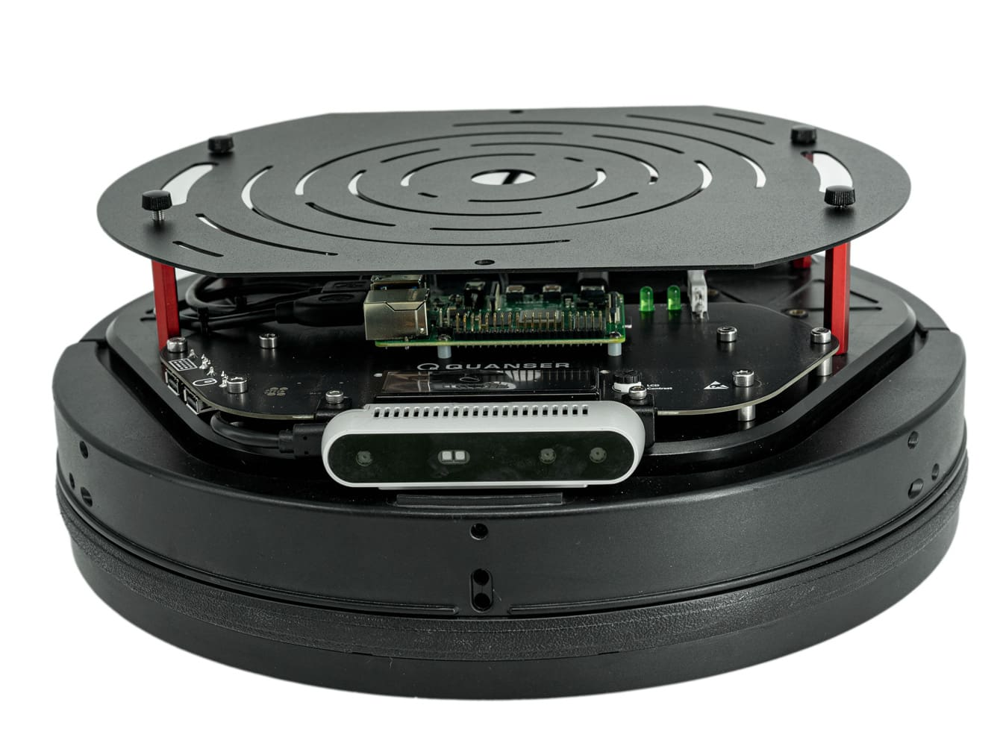
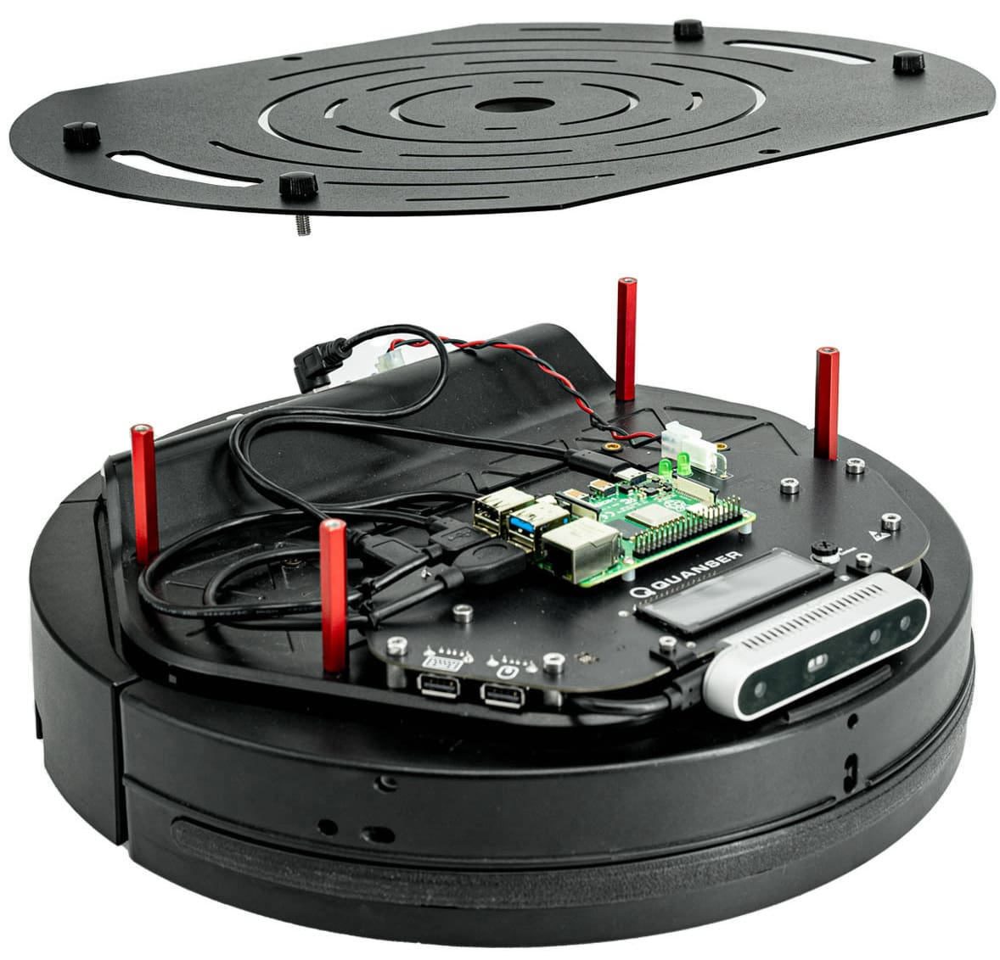
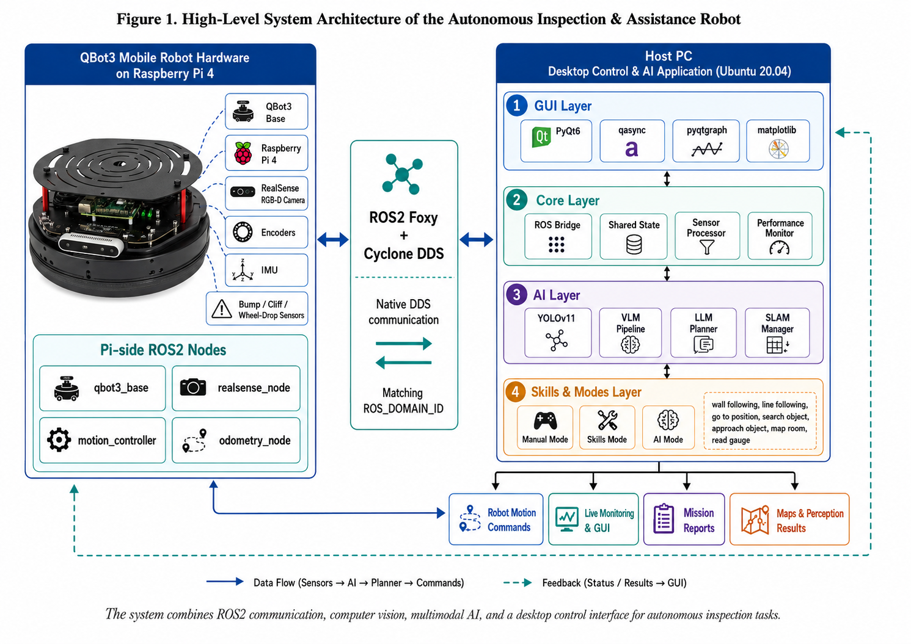
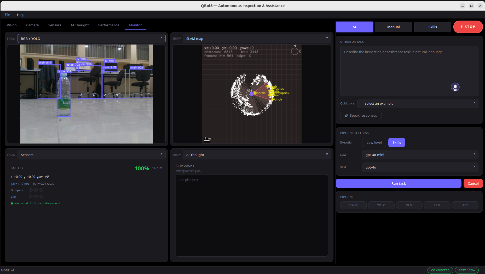
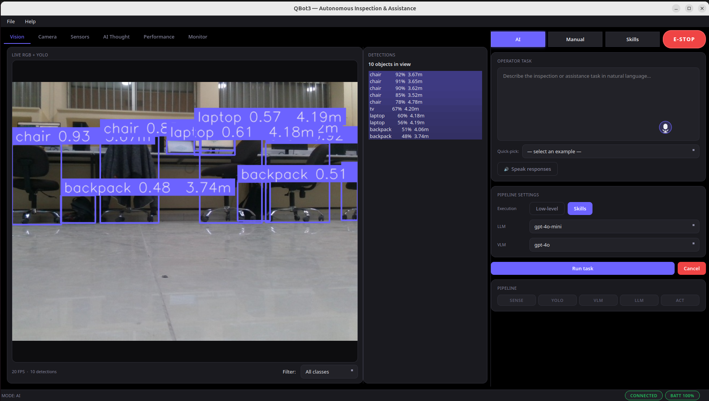
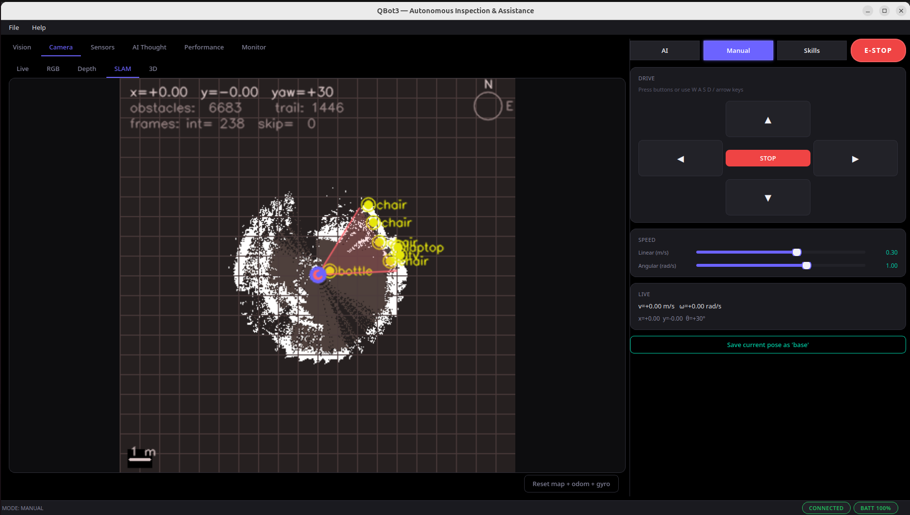
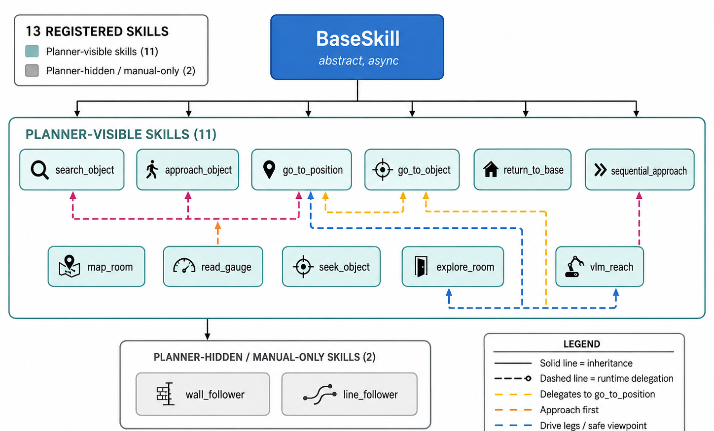

# QBot3 — VLA-Powered Autonomous Inspection & Assistance Robot

<p align="center">
  <strong>An AI-driven robotics platform combining Vision-Language-Action models with ROS2 for autonomous mobile robot operation</strong>
</p>

<p align="center">
  
  
  
  
  
  
</p>

---

<p align="center">
  
  &nbsp;&nbsp;&nbsp;
  
</p>
<p align="center"><em>Quanser QBot3 with Raspberry Pi 4 and Intel RealSense D435i depth camera</em></p>

---

## Overview

QBot3 is a production-grade desktop control application for the **Quanser QBot3** mobile robot. It features a full AI perception-to-action pipeline where a Vision-Language Model (VLM) understands the scene, a Large Language Model (LLM) plans multi-step tasks, and a library of skills executes motor actions — all coordinated through a professional PyQt6 dashboard.

> **Graduation Project** — Demonstrating mastery of robotics, AI/ML pipelines, ROS2, and professional GUI engineering.

## ✨ Features

- **3 Operating Modes:** AI autonomous, manual teleop, and individual skill execution
- **AI Pipeline:** YOLOv11 detection → VLM scene analysis → LLM planning → motor action
- **16 Skills:** Wall following, line following, object search/approach, room mapping, gauge reading, return-to-base, sequential approach, go-to-position, VLM reach, speak text, and more
- **Real-time Dashboard:** Camera feeds (RGB/depth/SLAM/3D point cloud), sensor plots, AI thought panel, performance metrics
- **Block Programming:** Visual drag-and-drop skill sequencing in the GUI
- **VLM/LLM Support:** OpenAI GPT-4o, Google Gemini 1.5, fusion mode, YOLO-only fallback
- **Voice I/O:** Speech-to-text commands and text-to-speech responses
- **Object Memory:** Persistent spatial memory of detected objects with 3D positions
- **Mission Reports:** Auto-generated LaTeX PDF reports for each completed task
- **Simulation Mode:** Synthetic sensors when the robot is unreachable

## 🏗️ Architecture

<p align="center">
  
</p>

## 🖥️ GUI Dashboard

<p align="center">
  
</p>
<p align="center"><em>AI Mode — YOLO detection, SLAM map, sensor readings, AI thought panel, and pipeline controls</em></p>

<p align="center">
  
  &nbsp;&nbsp;
  
</p>
<p align="center"><em>Left: Live YOLO object detection with depth — Right: SLAM occupancy map with object memory</em></p>

## 🤖 Skills Architecture

<p align="center">
  
</p>

## 📂 Project Structure

```
VLA_Qbot/
├── main.py                  ← Application entry point
├── requirements.txt         ← Python dependencies
├── run_qbot.sh              ← Launch script
├── .gitignore
│
├── ai/                      ← AI pipeline
│   ├── vlm_pipeline.py      ← VLM scene understanding
│   ├── llm_planner.py       ← LLM task planner (JSON output)
│   ├── slam_manager.py      ← SLAM + occupancy grid
│   ├── yolo_world_detector.py
│   ├── vlm_grounding.py     ← VLM-based visual grounding
│   ├── target_belief_map.py ← Probabilistic target tracking
│   ├── model_registry.py    ← Multi-provider model management
│   └── prompt_templates.py  ← LLM/VLM prompt engineering
│
├── core/                    ← Core subsystems
│   ├── ros_bridge.py        ← ROS2 rclpy interface (pub/sub)
│   ├── shared_state.py      ← Thread-safe global state
│   ├── sensor_processor.py  ← Sensor fusion & filtering
│   ├── object_memory.py     ← Persistent spatial object memory
│   ├── voice_io.py          ← Speech-to-text & text-to-speech
│   └── performance_monitor.py
│
├── gui/                     ← PyQt6 GUI
│   ├── main_window.py       ← Main window wiring
│   ├── theme.py             ← Dark theme design system
│   ├── widgets/             ← Camera, sensors, AI panel, block programming, etc.
│   └── dialogs/             ← Settings & skill config editors
│
├── skills/                  ← 16 robot skill implementations
│   ├── base_skill.py        ← Abstract skill base class
│   ├── explore_room.py, seek_object.py, vlm_reach.py, ...
│   └── speak_text.py
│
├── modes/                   ← Operating mode coordinators
│   ├── mode_ai.py           ← Autonomous AI mode
│   ├── mode_manual.py       ← Manual teleop mode
│   └── mode_skills.py       ← Individual skill execution mode
│
├── qbotpi/                  ← Raspberry Pi ROS2 nodes
│   ├── qbot3_base.py        ← Hardware driver
│   ├── realsense_node.py    ← Intel D435i camera node
│   ├── motion_controller.py ← Precise movement controller
│   └── odometry_node.py     ← Encoder + IMU odometry
│
├── config/
│   ├── settings.example.json ← Configuration template
│   └── skills_config.yaml    ← Per-skill parameter defaults
│
└── models/                  ← ML model weights (not tracked — see models/README.md)
```

## 🚀 Getting Started

### Prerequisites

#### Raspberry Pi (Robot)
- Ubuntu 20.04 + ROS2 Foxy
- Quanser QBot3 SDK (`qbot3.lib_qbot`)
- Intel RealSense SDK 2.0 + `pyrealsense2`
- `kobuki_ros_interfaces` (may need [from-source build](qbotpi/README.md))
- `ros-foxy-rmw-cyclonedds-cpp`

#### Host PC
- Ubuntu 20.04 + ROS2 Foxy (must match the Pi for DDS interop)
- Python 3.11+

### Installation

```bash
# 1. Clone the repository
git clone https://github.com/YOUR_USERNAME/VLA_Qbot.git
cd VLA_Qbot

# 2. Install ROS2 dependencies (one-time)
sudo apt install ros-foxy-rclpy ros-foxy-cv-bridge ros-foxy-rmw-cyclonedds-cpp \
                 ros-foxy-sensor-msgs ros-foxy-std-msgs ros-foxy-nav-msgs \
                 ros-foxy-geometry-msgs ros-foxy-kobuki-ros-interfaces

# 3. Install Python dependencies
pip install -r requirements.txt

# 4. Download model weights (see models/README.md for details)
python -c "from ultralytics import YOLO; YOLO('yolo11l.pt')"

# 5. Configure API keys
cp config/settings.example.json config/settings.json
# Edit config/settings.json with your OpenAI and Google API keys

# 6. Source ROS2 environment
source /opt/ros/foxy/setup.bash
export RMW_IMPLEMENTATION=rmw_cyclonedds_cpp
export ROS_DOMAIN_ID=0

# 7. Launch
python main.py
```

### Pi Setup

```bash
sudo -i
source /opt/ros/foxy/setup.bash
source /home/pi/ros2/install/setup.bash
export RMW_IMPLEMENTATION=rmw_cyclonedds_cpp
export ROS_DOMAIN_ID=0     # must match the host

# Launch each node in a separate terminal:
ros2 run qbot3 qbot3_base
ros2 run qbot3 realsense_node
ros2 run qbot3 motion_controller
ros2 run qbot3 odometry_node
```

See [qbotpi/README.md](qbotpi/README.md) for the full guide including `systemd` autostart.

### Simulation Mode (No Robot)

If the ROS bridge cannot connect, the app automatically falls back to synthetic sensor data. Configure in `config/settings.json` under `simulation.enable_when_disconnected`.

## ⚙️ Configuration

| File | Purpose |
|------|---------|
| `config/settings.json` | Robot connection, API keys, AI defaults, safety limits, UI prefs |
| `config/skills_config.yaml` | Per-skill parameter defaults |

Both files are editable via the GUI: **File → Settings** and **File → Skills Config**.

## ⌨️ Keyboard Shortcuts

| Key | Action |
|-----|--------|
| `W` / `↑` | Drive forward (manual mode) |
| `S` / `↓` | Drive backward |
| `A` / `←` | Turn left |
| `D` / `→` | Turn right |
| `Space` | Emergency stop |
| `Esc` | Cancel AI task |
| `1` / `2` / `3` | Switch to AI / Manual / Skills mode |

## 🛠️ Tech Stack

| Layer | Technologies |
|-------|-------------|
| Robot | ROS2 Foxy, Quanser SDK, Intel RealSense D435i |
| Transport | Native DDS via rclpy + Cyclone DDS |
| Vision | OpenCV 4.9, Ultralytics YOLOv11, YOLO-World, Open3D |
| AI | OpenAI GPT-4o, Google Gemini 1.5 Pro/Flash |
| GUI | PyQt6, qasync, pyqtgraph, matplotlib |
| Async | asyncio + qasync (QEventLoop bridge) |

## 📄 License

This project was developed as a Senior project design in Mechatronics Engineering Department at the University of Jordan. All rights reserved. 
